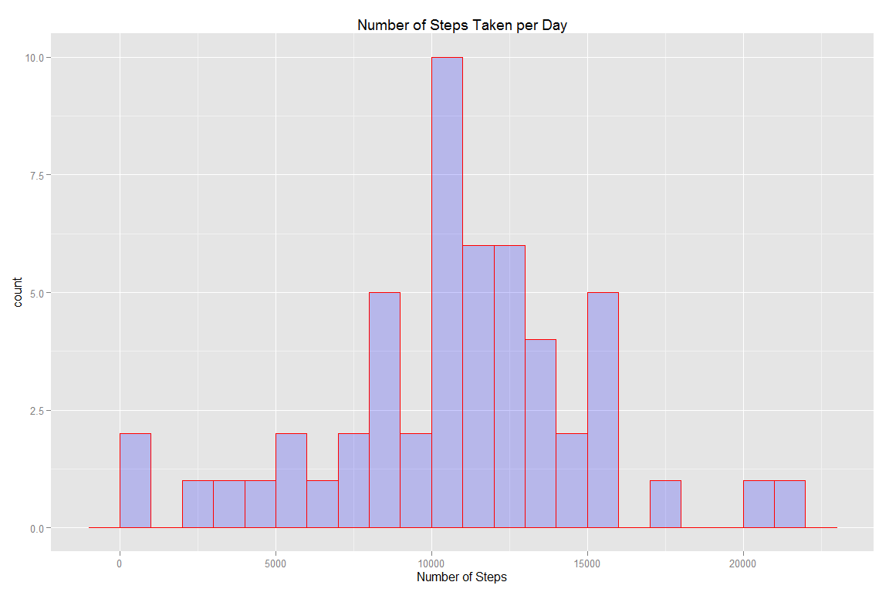
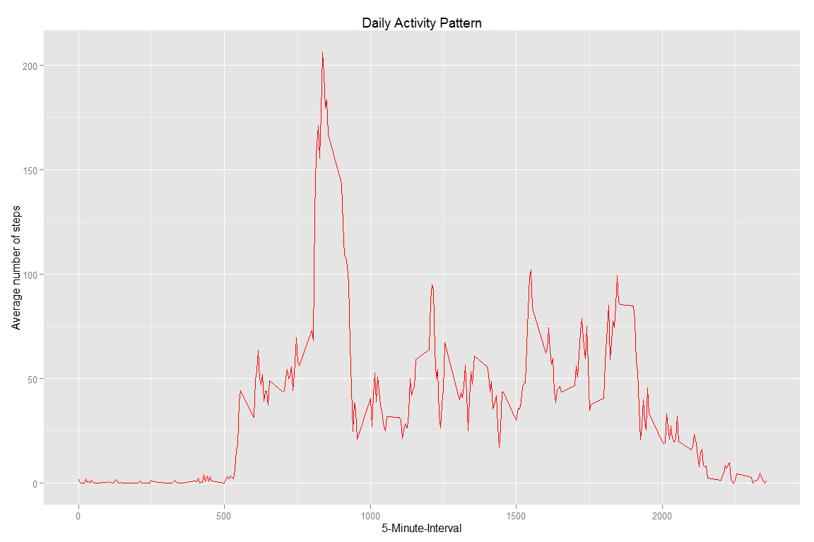
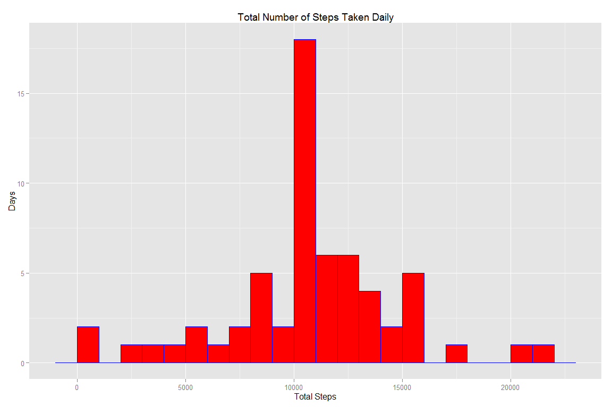
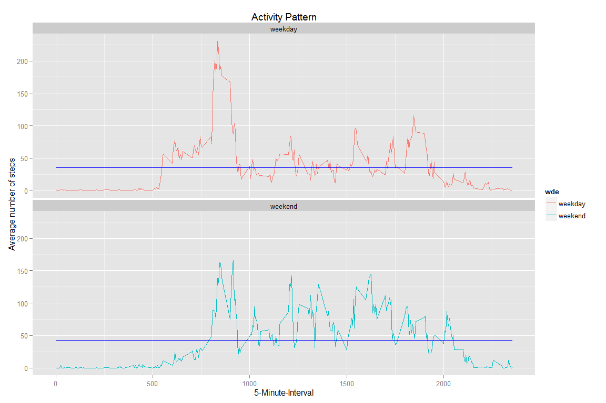

##**Reproducible Research Assignment 1**
####By mader02

###**Data**
The data for this assignment can be downloaded from the course web site:

* Dataset: Activity monitoring data [52K]

The variables included in this dataset are:

* steps: Number of steps taking in a 5-minute interval (missing values are coded as NA)
* date: The date on which the measurement was taken in YYYY-MM-DD format
* interval: Identifier for the 5-minute interval in which measurement was taken

The dataset is stored in a comma-separated-value (CSV) file and there are a total of 17,568 observations in this dataset.

```r
download.file("https://d396qusza40orc.cloudfront.net/repdata%2Fdata%2Factivity.zip",destfile = "activity.zip",method="curl")
activity.csv <- unzip("activity.zip")
```

###**Loading and preprocessing the data**

The data was downloaded from the repository, decompressed and stored as a dataset in R. The following function was used


```r
activity<-read.csv("activity.csv",stringsAsFactors = FALSE)
```
###**What is mean total number of steps taken per day?**

* Create new dataset without all the missing data
* Plot histogram for number of steps taken perday
* Calculate the mean and median of steps taken perday


```r
##load data.tabla
library(data.table)
##Create new dataset without the missing data (NA)
activity_rm<-subset(data.table(activity),steps !="NA")
```

```r
##load ggplot2 package
library(ggplot2)
##calculate number of steps perday
steps_perday<-tapply(activity_rm$steps,activity_rm$date,sum)
#use ggplot to plot histogram for number of steps perday
qplot(as.numeric(steps_perday),
      binwidth=1000,
      geom="histogram",
      main = "Number of Steps Taken per Day", 
      xlab = "Number of Steps", 
      fill=I("blue"), 
      col=I("red"),
      alpha=I(.2))
```

 

```r
#calculate mean of total steps perday
mean(steps_perday)
```

```
## [1] 10766.19
```

```r
#calculate median of total steps perday
median(steps_perday)
```

```
## [1] 10765
```

###**What is the average daily activity pattern?**

* Calculate the average steps taken perinterval across all day
* Plot the 'I' graph
* Find the Interval which has the maximum value


```r
#load dplyr package
library(dplyr)
#using dplyr calculate average steps perinterval for each day
steps_int <- activity_rm%>%
        group_by(interval) %>%
        summarize(steps = mean(steps))

#using ggplot to plot the type "l" graph
g<-ggplot(steps_int,aes(x=interval,y=steps)) + geom_line(color="red")
g + labs(title="Daily Activity Pattern",x="5-Minute-Interval",y="Average number of steps")
```

 

```r
#find the maximum value
max(steps_int$steps)
```

```
## [1] 206.1698
```

```r
#find the interval with maximum value
steps_int$interval[steps_int$steps==max(steps_int$steps)]
```

```
## [1] 835
```

###**Imputing missing values**
* Replace all the missing values (NA) with the mean value as calculated in previous step
* Create new dataset where the (NA) has been replaced
* Plot histogram of the new dataset
* Study the impact of imputing missing data on the estimates of the total daily number of steps


```r
#Calculate total number of missing values 'NA' in the dataset 
length(activity[which(is.na(activity$steps)),1])
```

```
## [1] 2304
```

```r
#Calculate average value of total steps taken per Interval
steps_mean <- tapply(activity_rm$steps,activity_rm$interval,mean)
#Copy original dataset into another filename
activity_dt<-activity

#Replace the missing value 'NA' in the dataset with average value of total steps taken per Interval
activity_dt[which(is.na(activity_dt$steps)),1] <- steps_mean[as.character(activity_dt[which(is.na(activity_dt$steps)),3])]

#use dplyr to calculate the total steps taken daily
daily_sum <- activity_dt%>%
        group_by(date) %>%
        summarize(steps = sum(steps))
#use ggplot to plot the histogram
g2<-ggplot(daily_sum,aes(x=steps)) + geom_histogram(color="blue",fill="red",binwidth=1000) 
g2lab<-labs(title="Total Number of Steps Taken Daily",x="Total Steps",y="Days")
g2+g2lab
```

 

```r
#find the median value of steps taken daily
median(daily_sum$steps)
```

```
## [1] 10766.19
```

```r
#find the mean value of steps taken daily
mean(daily_sum$steps)
```

```
## [1] 10766.19
```
The impact of imputing missing data on the estimates of the total daily number of steps
is minimal with only slight changes in median value, whereas there was no changes with mean value, as shown below

```r
median(daily_sum$steps) - median(steps_perday)
```

```
## [1] 1.188679
```

```r
mean(daily_sum$steps) - mean(steps_perday)
```

```
## [1] 0
```
###**Are there differences in activity patterns between weekdays and weekends?**

* Create a new factor variable in the dataset with two levels - "weekday" and "weekend" indicating whether a given date is a weekday or weekend day.
* plot panel containing a time series plot (i.e. type = "l") of the 5-minute interval (x-axis) and the average number of steps taken, averaged across all weekday days or weekend days (y-axis)


```r
library(dplyr)
#create new factor variable "day" represent day of given date
activity_dt$day <- as.factor(weekdays(as.Date(activity_dt$date)))
#create new factor variables "weekday" & "weekend"  indicating whether a given date is a weekday or weekend day.
activity_dt$wde <-as.factor(ifelse(activity_dt$day=="Sunday"|activity_dt$day=="Saturday", "weekend", "weekday"))

###use dplyr to calculate average steps, and to apply wether the day is weekday or weekend
activity_mean <- activity_dt %>%
        group_by(interval, wde) %>%
        summarise(steps = mean(steps))

## use ggplot to plot the graph and make comparison of average steps between weekday & weekend

ggplot(activity_mean, aes(x=interval, y=steps, color = wde)) +
        geom_line() +
        facet_wrap(~wde, ncol = 1, nrow=2) + labs(title="Activity Pattern",x="5-Minute-Interval",y="Average number of steps")
```

 


